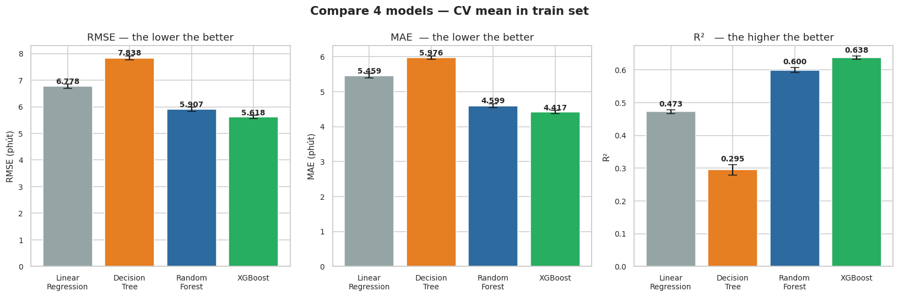
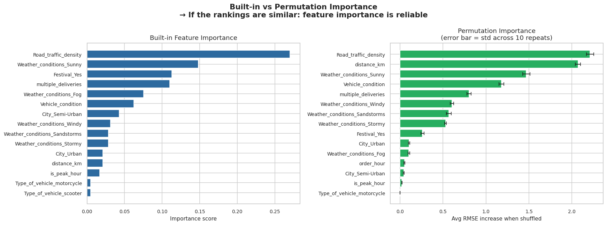
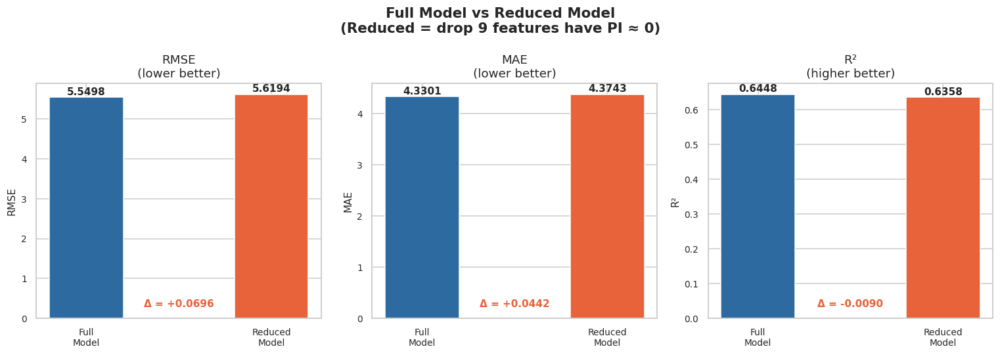
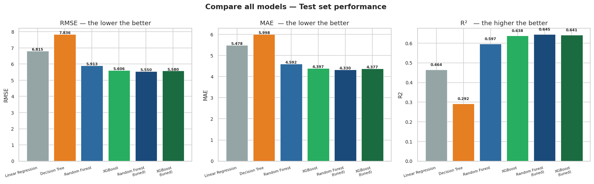
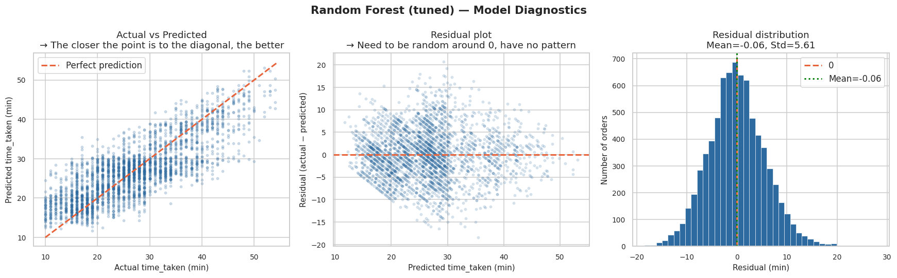

# 🛵 Zomato Delivery Time Prediction

## 📌 1. Context & Problem Statement
- **Context**: Zomato is a leading tech platform in India for restaurant discovery, reviews, and online food delivery.
- **Problem Statement**: Zomato currently provides **a fixed ETA for all orders**, which doesn't reflect real-world conditions (traffic, weather, distance, etc.), hurting customer experience. Additionally, leadership and the Operations team lack a reliable basis to evaluate delivery performance.
- **Objective**: _Build a model to predict delivery time_ under specific conditions, in order _to optimize customer experience_ and support _dynamic ETA notifications_ for Zomato's delivery operations.

## 🔧 2. Tools & Technical Deep Dive
### 2.1 Tools
- Python (pandas, matplotlib, seaborn)
- scikit-learn (Linear Regression, Decision Tree, Random Forest, XGBoost)
- Jupyter Notebook

### 2.2 Data Understanding
- Missing values found in the `Time_Orderd` column.
- `Delivery_person_Age` values are inconsistent.
- Some orders have restaurant/customer locations falling outside India's geographic boundaries.

### 2.3 Data Preprocessing
- Dropped missing values, since most missing values were concentrated in `Time_Orderd` — a feature not suitable for imputation.
- Reformatted datetime, longitude, and latitude fields.
- Engineered a new distance feature (in km) using the Haversine formula based on longitude/latitude.

### 2.4 EDA
- Based on EDA findings, removed noisy/irrelevant features and selected 12 key features with the strongest influence on delivery time.

### 2.5 Feature Engineering
- **Encoding**: OrdinalEncoder, OneHotEncoder
- **Scaling**: StandardScaler

### 2.5 Model & Optimization
- **Algorithm Benchmarking**: Evaluated and compared four regression algorithms — Linear Regression, Decision Tree, Random Forest, and XGBoost
  — using 5-Fold Cross-Validation to ensure model stability and mitigate overfitting risk.
- **Hyperparameter Tuning**: Used RandomizedSearchCV to optimize parameters for the two best-performing baseline models: Random Forest and XGBoost.
- **Evaluation Metrics**: Compared the two tuned models using RMSE, MAE (lower is better), and R² (higher is better).

## 📊 3. Results & Insights
### 3.1 Results
After tuning, the _**Random Forest**_ model achieved the best performance.

### 3.2 Key Findings 
- Core drivers: traffic density, distance and weather conditions 
  significantly affect delivery times — but difficult to control directly
- Allocations of shippers is not efficient

## 💡 4. Recommendations & Limitations - Next Steps
- See in the report (Vietnamese ver): [Report](https://canva.link/xvezzyl42k8psb3)

## 📁 5. Dataset
Source: [Zomato Delivery Operations Analytics Dataset – Kaggle](https://www.kaggle.com/datasets/saurabhbadole/zomato-delivery-operations-analytics-dataset)
