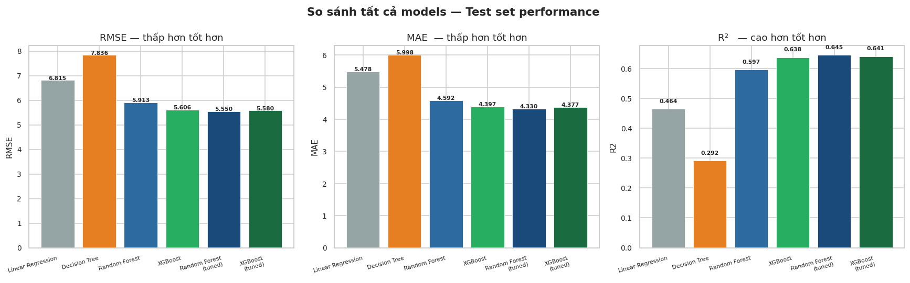

# 🛵 Zomato Delivery Time Prediction

## 📌 Objective
Predict delivery times under specific conditions to optimize 
customer experience and support dynamic ETA notifications 
for Zomato delivery operations.

## 🔧 Tools & Technologies
- Python (pandas, matplotlib, seaborn)
- scikit-learn (Linear Regression, Random Forest, XGBoost)
- Jupyter Notebook

## 📊 Key Findings
- Random Forest achieved RMSE=5.5 min, MAE=4.33 min, R²=64.5%
- Core drivers: traffic density, distance and weather conditions 
  significantly affect delivery times
- Core drivers are external factors — difficult to control directly

## 💡 Recommendations
- Use ETA ranges instead of fixed time to notify customers
- Develop strategies for assigning shippers in bad weather 
  or high-traffic conditions

## 📁 Dataset
Source: [Zomato Delivery Operations Analytics Dataset – Kaggle](https://www.kaggle.com/datasets/saurabhbadole/zomato-delivery-operations-analytics-dataset)

## 📷 Preview

